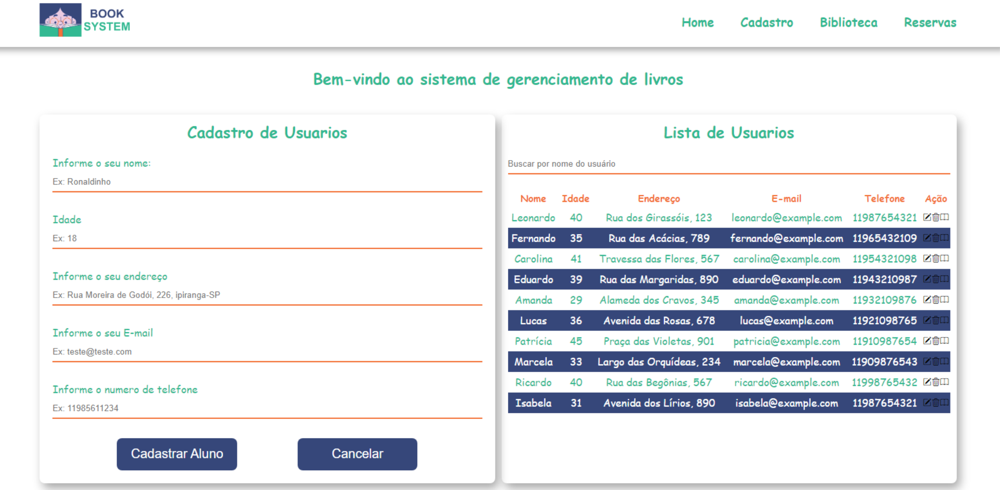

# Projeto API de Cadastro de Usuários e Livros

Este projeto consiste na criação de uma API utilizando o Json-Server para cadastro de usuários e livros. Além disso, implementa diversas funcionalidades relacionadas à gestão do acervo de livros e usuários.

## 🎨 Layout

O layout da aplicação está disponível no Figma:

## Funcionalidades Implementadas

#### Usuários: 
- Cadastro de usuários com os campos: nome, idade, endereço, e-mail e telefone.
- Edição de usuários existentes.
- Exclusão de usuários do sistema.
- Listagem de todos os usuários cadastrados.
- Busca de usuários por nome.

#### Livros:

- Cadastro de livros com os campos: nome, autor, biografia, edição e editora.
- Edição de informações de livros existentes.
- Exclusão de livros do acervo.
- Listagem de todos os livros disponíveis.
- Funcionalidades Adicionais
- Busca de livros por título.

### Desafios:

- Exibição dos usuários que reservaram um determinado livro.
- Exibição dos livros que um determinado usuário reservou.

#### Ferramentas Utilizadas

- Json-Server: Servidor para criar APIs Fake.
- Consumo de API ViaCep para busca do endereço do usuário
- Git Project: Organização de tarefas.
- GitHub: Controle de versão e colaboração no código.
- HTML, BootStrap icons, CSS e JS: Linguagens utilizadas para o desenvolvimento da interface do usuário e consumo da API.

### Como Executar

- Clone o repositório: git clone https://github.com/juninho-Oliveira/Sistema-de-gerenciamento-de-livros.git

- Instale as dependências: npm install
- Inicie o servidor Json-Server: npm run server
- Abra o arquivo index.html em seu navegador.

#### Criadores 

<table>
  <tr>    
  <td align="center">
      <a href="https://github.com/juninho-Oliveira">
         
        
          <b>Damião Júnior</b>
        
      </a>
    </td>
    <td align="center">
      <a href="https://github.com/alexesouza">
         
        
          <b>Alex Moreira</b>
        
      </a>
    </td>
  </tr>
</table> 